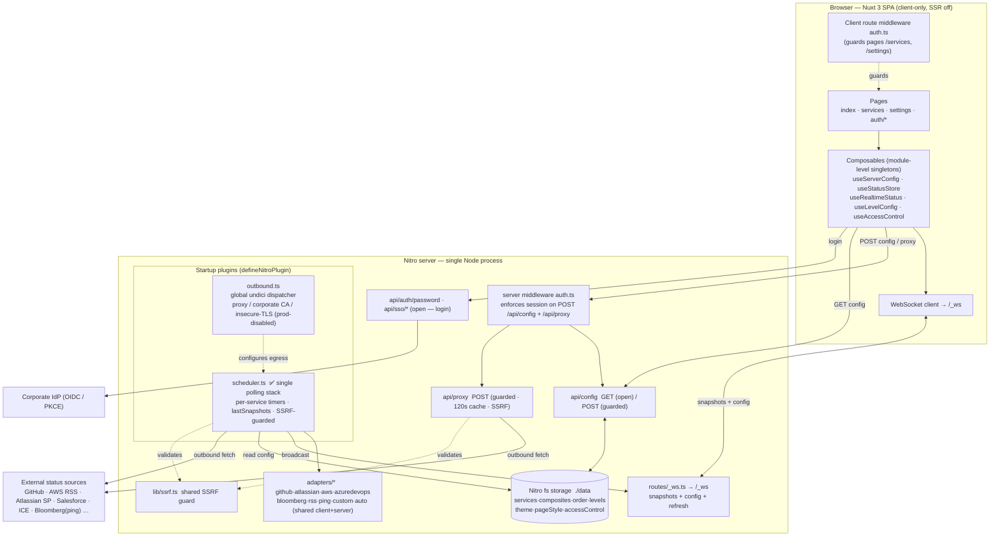
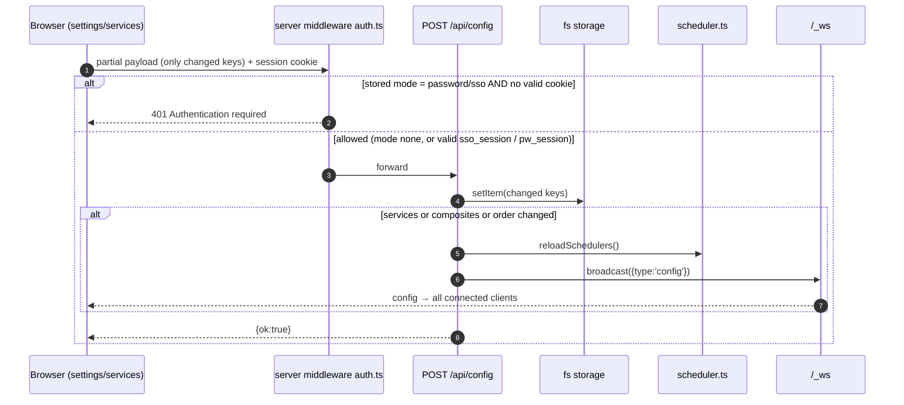

# Sentinel — Status Concentrator Dashboard · Architecture (ADB submission)

> Scope: architecture as it exists in the codebase today (`main`), for ADB review ahead of a PROD rollout.
> Stack: **Nuxt 3 / Nitro**, single Node process, server-side polling + WebSocket fan-out, file-backed config.
> Diagrams are Mermaid (render in GitHub, VS Code, most ADB tooling).
>
> **Status:** the findings raised in the first review (F1–F6) have been addressed — see §5. The diagrams below show the **post-remediation** architecture: a single polling stack, a single WebSocket endpoint, server-enforced API auth, and one shared SSRF guard.

---

## 1. System context & runtime components



**Legend:** ✅ the single live polling stack. Every outbound path validates through `lib/ssrf.ts`; every mutating API call passes the server `auth` middleware.

---

## 2. Real-time status flow

```mermaid
sequenceDiagram
  autonumber
  participant B as Browser (useRealtimeStatus)
  participant WS as /_ws (routes/_ws.ts)
  participant S as scheduler.ts
  participant G as lib/ssrf.ts
  participant X as External status API
  participant ST as fs storage (./data)

  Note over S: boot + setInterval(reloadSchedulers, 30s)
  S->>ST: read services / composites
  loop per enabled service/child, every pollInterval (60–1200s)
    S->>G: assertPublicUrl(url)
    S->>X: serverFetch(url, headers)
    X-->>S: JSON · XML(_raw) · ping status code
    S->>S: runAdapter() → AdapterResult → StatusSnapshot
    S->>WS: broadcast({type:'snapshot'})
    WS-->>B: snapshot → pushSnapshot(); clear loading[serviceId]
  end

  B->>WS: WS open
  WS-->>B: replay lastSnapshots + full config
  B->>WS: {type:'refresh', serviceId}
  WS->>S: triggerRefresh(serviceId) → immediate re-poll
  Note over S,WS: child refresh keyed by bare childId (now consistent client↔server)
```

## 3. Configuration write flow (now auth-gated)



---

## 4. Data & deployment characteristics

| Concern | Current state |
|---|---|
| Config persistence | Nitro **fs** driver, base `./data` (one JSON file per key). Shared across all users of the deployment. |
| Runtime state | **In-process memory only**: `lastSnapshots`, WS `peers`, proxy cache. See F4 (accepted single-instance constraint). |
| Scaling model | **Single instance** (see F4). |
| Cold start | Dashboard is blank until the first poll of each service completes. |
| Egress control | `outbound.ts` env-gated: `HTTPS_PROXY/HTTP_PROXY`, `STATUS_CA_FILE` (merge corporate root CA), `STATUS_INSECURE_TLS` (**ignored when `NODE_ENV=production`**). |
| Transport | WebSocket (`/_ws`, experimental Nitro WS) + REST (`/api/*`). |
| Auth | Optional: shared-password (SHA-256) **or** OIDC/PKCE. Sessions are `httpOnly` cookies (`sso_session`, `pw_session`), enforced server-side on the privileged API. |

---

## 5. Findings — resolution status

| # | Severity | Finding | Resolution |
|---|---|---|---|
| F1 | High | Duplicate polling subsystems (`scheduler.ts` + `poller.ts`) both polled every service; only one reached the UI. | **Resolved.** Consolidated onto `scheduler.ts` + `/_ws` + `useRealtimeStatus`. Deleted `poller.ts`, `pollerState.ts`, `api/ws.ts`, and the legacy client `usePolling.ts` / `useScheduler.ts`. Composite-child refresh re-homed onto `useRealtimeStatus` (`loading` + `refreshChild`). |
| F2 | High | API routes unauthenticated server-side; config/proxy open to anyone reaching the server. | **Resolved.** Added `server/middleware/auth.ts` enforcing the stored access mode on `POST /api/config` and `/api/proxy`. Added `POST /api/auth/password` to mint an `httpOnly` `pw_session`; SSO already sets `sso_session`. Logout clears both. |
| F3 | Medium | Inconsistent SSRF protection; the live `scheduler` path had none; cloud-metadata not blocked. | **Resolved.** New `server/lib/ssrf.ts` shared guard (loopback, `10/8`, `172.16/12`, `192.168/16`, `169.254/16` incl. `169.254.169.254`, IPv6 ULA/link-local). Applied in `scheduler.serverFetch` and `proxy.post`. |
| F4 | Medium | Single-instance in-memory state (snapshots, peers, cache). | **Accepted constraint — documented.** Deploy as a single instance. If HA/replicas are later required, introduce a shared store (e.g. Redis) for snapshots + sticky WS sessions. Tracked, not blocking for the initial single-instance PROD. |
| F5 | Low | `STATUS_INSECURE_TLS` could disable cert verification anywhere. | **Resolved.** `outbound.ts` ignores the flag when `NODE_ENV=production` and logs a warning. |
| F6 | Low | Two WS endpoints / two `peers` sets / two `broadcast`s. | **Resolved** as part of F1 — single endpoint `/_ws`, single `peers`/`broadcast`. |

### Residual notes for the board
- **Weak demo credential:** the stored `accessControl.passwordHash` is the SHA-256 of `test`. Set a strong password before PROD. (Data/config, not code.)
- **F4** is the only item intentionally left as an accepted constraint; confirm the single-instance deployment target with the board.
- After deploying F2, already-connected sessions must re-authenticate once (to obtain the new `pw_session` cookie) before they can write config.

---

## 6. Component inventory (post-remediation)

- **Plugins:** `server/plugins/outbound.ts`, `server/plugins/scheduler.ts` (sole polling stack)
- **WS:** `server/routes/_ws.ts` (`/_ws`, single endpoint)
- **API:** `server/api/config.{get,post}.ts`, `server/api/proxy.post.ts`, `server/api/auth/password.post.ts`, `server/api/sso/{discover,callback,session,logout}.*`
- **Security:** `server/middleware/auth.ts` (API auth), `server/lib/ssrf.ts` (shared SSRF guard)
- **Adapters (shared client+server):** `adapters/{github,atlassian,aws,azuredevops,bloomberg,rss,ping,custom}.ts`, registry `adapters/index.ts`
- **Client:** `pages/*`, `composables/*` (module-singleton state, no Pinia; realtime via `useRealtimeStatus`), `middleware/auth.ts`
- **Storage:** Nitro `fs` driver → `./data/{services,composites,order,levels,theme,pageStyle,accessControl}`
```
